 

## 🛠️ Arsenal — Tools I Build

<table width="100%">
<tr>
<td width="33%" valign="top">

### 🕸️ [Akha-XSS](https://github.com/akha-security/akha-xss)

**Advanced XSS Detection Framework**

Automatically detects reflected, stored, and DOM-based XSS vulnerabilities in modern web applications.

`Python` `Public` ⭐ 1

</td>
<td width="33%" valign="top">

### 🗺️ [Akha-Sourcemap](https://github.com/akha-security/akha-sourcemap)

**Source Map Intelligence Tool**

Analyzes `.js.map` files to uncover hidden endpoints, secrets, and sensitive information left exposed in source maps.

`Python` `Public`

</td>
<td width="33%" valign="top">

### ⚡ [Akca](https://github.com/akha-security/akca)

**Bug Bounty Vulnerability Scanner** — 🚧 *In Development*

A next-generation scanner built for bug bounty hunters, designed for fast and reliable vulnerability discovery. Coming soon.

`Public` `Coming Soon`

</td>
</tr>
</table>

 

## 💻 Live Demo

 

## 🐍 Contribution Graph

 

## 📊 GitHub Stats

 

 

## 🧰 Tech Stack

 

## 🔗 Connect

 

### 💬 *"Open-sourcing offensive security tools, one vulnerability class at a time."*

**Star a repo, open an issue, or drop a PR — every contribution helps the bug bounty community.**

